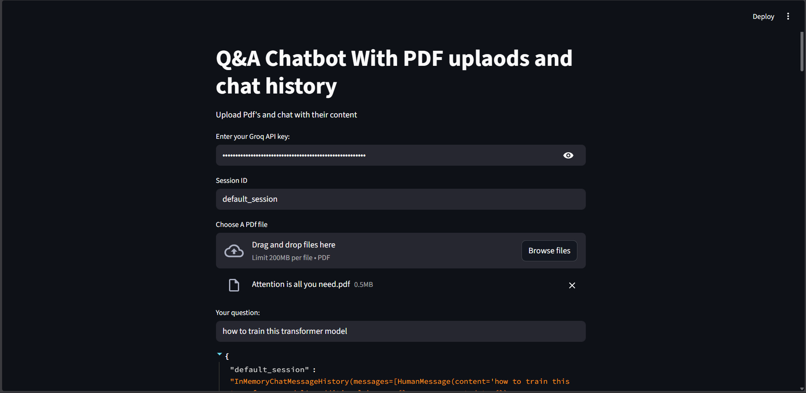
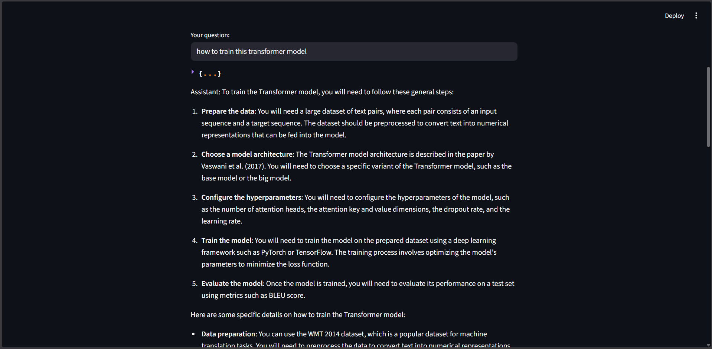
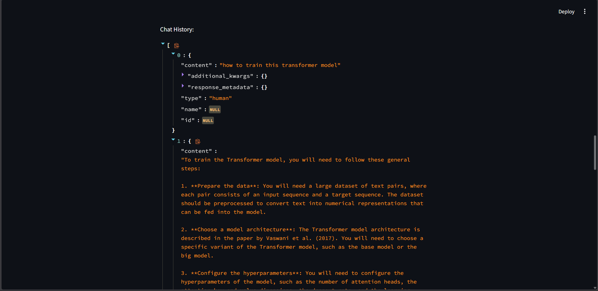

# Conversational PDF Q&A Chatbot (RAG-Based)

A simple yet well-structured Retrieval-Augmented Generation (RAG) chatbot that allows users to upload PDF documents and ask questions conversationally, with support for chat history and follow-up queries.

This project is designed as a learning-focused implementation to demonstrate core RAG concepts, conversational memory handling, and document-grounded question answering using modern LLM tooling.

## 🚀 Project Overview

Large Language Models are powerful, but they struggle with:

- Private or custom documents
- Knowledge beyond their training data
- Context-aware follow-up questions

This project addresses those limitations by combining:

- PDF document ingestion
- Vector-based semantic search
- History-aware question reformulation
- Context-grounded answer generation

The result is a lightweight, interactive chatbot that can answer questions strictly based on uploaded PDFs, while maintaining conversational continuity.

## 📸 Screenshots

### PDF Upload UI



### Question Answering



### Chat History



## 🧠 Key Concepts Demonstrated

- Retrieval-Augmented Generation (RAG)
- Semantic document chunking and embeddings
- Vector similarity search
- Conversational memory handling
- History-aware query reformulation
- Prompt engineering for grounded responses

This makes the project ideal for learning, experimentation, and portfolio demonstration.

## ✨ Features

- Upload one or multiple PDF documents

- Ask questions grounded in document content

- Ask follow-up questions using chat history

- Session-based conversation memory

- Simple Streamlit-based UI

- Secure runtime API key input

- Clean and modular LangChain pipeline

## 🏗️ High-Level Architecture

The system follows a straightforward RAG pipeline:

1. User uploads PDF files

2. PDFs are loaded and split into text chunks

3. Chunks are embedded using a sentence-transformer model

4. Embeddings are stored in an in-memory vector database

5. User questions are reformulated using chat history

6. Relevant chunks are retrieved via semantic search

7. The LLM generates a concise, context-aware answer

This architecture keeps the system simple, transparent, and easy to reason about.

## 🛠️ Tech Stack

**Frontend/UI**

- Streamlit

**LLM Inference**

- Groq (llama-3.1-8b-instant)

**Embeddings**

- HuggingFace (all-MiniLM-L6-v2)

**Vector Store**

- Chroma (in-memory)

**Frameworks & Libraries**

- LangChain
- Python
- dotenv

## Environment Variables

To run this project, you will need to add the following environment variables to your .env file

`HF_TOKEN`

This token is used for loading HuggingFace embedding models.

> Note: The Groq API key is entered securely at runtime via the Streamlit UI and is not stored as an environment variable.

## ⚙️ Setup & Installation

### Prerequisites

- Python 3.9+
- Groq API Key
- HuggingFace token (for embeddings)

### Steps

1. Clone the repository:

```bash
git clone https://github.com/Sarvesh8010/Conversational-PDF-Q-A-Chatbot-RAG-Based-.git
cd Conversational-PDF-Q-A-Chatbot-RAG-Based-
```

2. Install dependencies:

```bash
pip install -r requirements.txt
```

3. Set environment variables:

```bash
HF_TOKEN=your_huggingface_token_here
```

4. Run the app:

```bash
streamlit run app.py
```

5. Enter your Groq API key in the UI and start chatting.

## 💬 Usage Guide

1. Upload one or more PDF files

2. Enter a session ID (optional)

3. Ask a question about the document

4. Ask follow-up questions naturally

5. The chatbot answers strictly using retrieved document context

## ⚠️ Known Limitations

This project is intentionally simple and has some limitations:

- Vector store is recreated on every run
- No persistent storage for embeddings
- Temporary file overwrite for PDFs
- No source citation in responses
- Not optimized for very large documents

These tradeoffs were made to keep the system easy to understand and modify.

## 🔮 Possible Improvements

Future enhancements could include:

- Persistent vector database
- Source attribution for answers
- Metadata-based retrieval
- Improved PDF handling
- Authentication and multi-user support
- Cloud deployment
- Retrieval quality evaluation

## 🙌 Acknowledgements

- [Langchain](https://www.langchain.com/)
- [Streamlit](https://streamlit.io/)
- [Groq](https://groq.com/)
- [HuggingFace](https://huggingface.co/)
